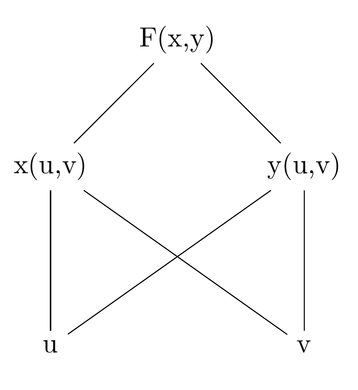

# Aufgabe 327
## Angabe

Es sei $F(x,y)=\frac{2x^4+y}{y^5-2x},\; x=2u-3v+1,\; y=u+2v-2$. Man berechne $\frac{\partial F}{\partial u}$ und $\frac{\partial F}{\partial v}$ für $u=2,\; v=1$ mit Hilfe der Kettenregel.

## Hilfreiches

**Satz 6.20 (Kettenregel)**

Sei $D \subseteq \R^n$ eine offene Menge, $f: D \to \R$ und $g: \R \to \R^n$ mit $g(x)=(g_1(x), \dots, g_n(x))$ und $g(\R) \subseteq D$. Weiters sei $F(x)=f(g(x))$. Dann gilt

$\displaystyle F'(x)=\sum_{i=1}^n f_{x_i}(g_1(x), …, g_n(x)) g_i'(x)$

In Leibniz'scher Notation:

$\displaystyle \frac{dF}{dx}=\sum_{i=1}^n \frac{\partial f}{\partial g_i}\cdot \frac{d g_i}{dx}$

## Lösungsvorschlag

### Kettenregel

$\displaystyle \frac{\partial F}{\partial u}=\textcolor{springgreen}{\frac{\partial F}{\partial x}}\cdot \textcolor{orange}{\frac{\partial x}{\partial u}}+\textcolor{cyan}{\frac{\partial F}{\partial y}}\cdot \textcolor{magenta}{\frac{\partial y}{\partial u}}$
    
$\displaystyle \frac{\partial F}{\partial v}=\textcolor{springgreen}{\frac{\partial F}{\partial x}}\cdot \textcolor{brown}{\frac{\partial x}{\partial v}}+\textcolor{cyan}{\frac{\partial F}{\partial y}}\cdot \textcolor{purple}{\frac{\partial y}{\partial v}}$

### Ableitungen

$\displaystyle F(x(u,v),y(u,v))=\frac{2x^4+y}{y^5-2x}$

$\displaystyle \textcolor{springgreen}{\frac{\partial F}{\partial x}}=\frac{8x^3\cdot (y^5-2x)-(2x^4+y)\cdot (-2)}{(y^5-2x)^2}$

$\displaystyle \textcolor{cyan}{\frac{\partial F}{\partial y}}=\frac{1\cdot (y^5-2x)-(2x^4+y)\cdot (5y^4)}{(y^5-2x)^2}$

$x(u,v)=2u-3v+1$ \
$y(u,v)=u+2v-2$

$\displaystyle \textcolor{orange}{\frac{\partial x}{\partial u}}=2, \qquad \textcolor{magenta}{\frac{\partial y}{\partial u}}=1$

$\displaystyle \textcolor{brown}{\frac{\partial x}{\partial v}}=-3, \qquad \textcolor{purple}{\frac{\partial y}{\partial v}}=2$

### Einsetzen

$u=2,\quad v=1$

$x(2,1)=2\cdot 2-3\cdot 1+1=\textcolor{teal}{2}$ \
$y(2,1)=2+2\cdot 1-2=\textcolor{teal}{2}$

$\displaystyle \textcolor{springgreen}{\frac{\partial F}{\partial x}}(\textcolor{teal}{2,2})=\frac{8\cdot 2^3\cdot (2^5-2\cdot 2)-(2\cdot 2^4+2)\cdot (-2)}{(2^5-2\cdot 2)^2}=\frac{465}{196}$

$\displaystyle \textcolor{cyan}{\frac{\partial F}{\partial y}}(\textcolor{teal}{2,2})=\frac{1\cdot (2^5-2\cdot 2)-(2 \cdot 2^4+2)\cdot (5\cdot 2^4)}{(2^5-2\cdot 2)^2}=-\frac{673}{196}$

$\displaystyle \frac{\partial F}{\partial u}=\textcolor{springgreen}{\frac{465}{196}}\cdot \textcolor{orange}{2}+\textcolor{cyan}{\left(-\frac{673}{196}\right)}\cdot \textcolor{magenta}{1}=\frac{257}{196}$

$\displaystyle \frac{\partial F}{\partial v}=\textcolor{springgreen}{\frac{465}{196}}\cdot \textcolor{brown}{(-3)}+\textcolor{cyan}{\left(-\frac{673}{196}\right)}\cdot \textcolor{purple}{2}=-\frac{2741}{196}$