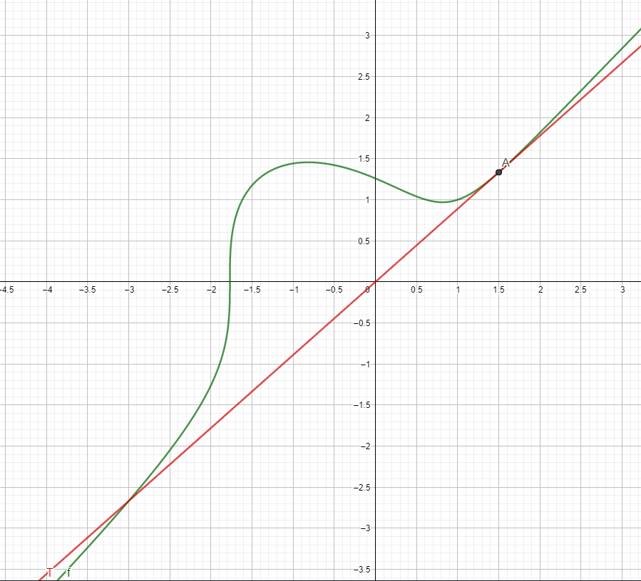

# Aufgabe 346
## Angabe

Man ermittle die Gleichungen einer Tangente aus dem Punkt $(0,0)$ an die durch $y^3=x^3-2x+2$ bestimmte Kurve.

## Lösungsvorschlag

### Skizze

### Kurve als Funktion

$y^3=x^3-2x+2$

$f(x)=\sqrt[3]{x^3-2x+2}$

### Tangente

Eine Tangente die durch den Ursprung geht hat die Form: $T(x)=k\cdot x$

Wir suchen nun eine unbekannte Stelle $a$ bei der die Tangente die Funktion berührt.

Tangente und Funktion müssen an dieser Stelle denselben Funktionswert und dieselbe Steigung haben.

Den Funktionswert der Tangente an der Stelle $a$ können wir wie folgt berechnen:

$f(a)=T(a)= \sqrt[3]{a^3-2a+2}=k\cdot a$

#### Ableitung

$f(x)=(x^3-2x+2)^{\frac{1}{3}}$ (Kettenregel)

$f'(x)=\frac{1}{3}\cdot (x^3-2x+2)^{-\frac{2}{3}}\cdot (3x^2-2)$

$\displaystyle f'(x)=\frac{(3x^2-2)}{3 \cdot (\sqrt[3]{x^3-2x+2})^2}$

$\displaystyle f'(x)=\frac{(3x^2-2)}{3 \cdot (\sqrt[3]{x^3-2x+2})^2}\cdot \frac{(\sqrt[3]{x^3-2x+2})}{(\sqrt[3]{x^3-2x+2})}$

$\displaystyle f'(x)=\frac{(3x^2-2) \cdot (\sqrt[3]{x^3-2x+2})}{3 \cdot (x^3-2x+2)}$

Steigung an der Stelle $a$ berechnen (Steigung der Tangente):

$\displaystyle k=f'(a)=\frac{(3a^2-2) \cdot (\sqrt[3]{a^3-2a+2})}{3 \cdot (a^3-2a+2)}$

### Stelle a 

$\displaystyle \cancel{\sqrt[3]{a^3-2a+2}}=\frac{(3a^2-2) \cdot \cancel{(\sqrt[3]{a^3-2a+2})}}{3 \cdot (a^3-2a+2)}\cdot a$

$\displaystyle 1=\frac{(3a^2-2)\cdot a}{3 \cdot (a^3-2a+2)}$

$\displaystyle \frac{3a^3-6a+6}{3a^3-6a+6}=\frac{3a^3-2a}{3a^3-6a+6}$

$\displaystyle \cancel{3a^3}-6a+6=\cancel{3a^3}-2a$

$4a=6$

$a=\frac{3}{2}$

Damit haben wir die Stelle $a$ gefunden und können mit Hilfe der Ableitung die Steigung an der Stelle $a$ ermitteln.

### Steigung an der Stelle a

$\displaystyle f'\left(\frac{3}{2}\right)=\frac{(3(\frac{3}{2})^2-2) \cdot (\sqrt[3]{(\frac{3}{2})^3-2(\frac{3}{2})+2})}{3 \cdot ((\frac{3}{2})^3-2(\frac{3}{2})+2)}$

$\displaystyle = \frac{(3(\frac{9}{4})-2) \cdot (\sqrt[3]{(\frac{27}{8})-3+2})}{3 \cdot ((\frac{27}{8})-3+2)}$

$\displaystyle = \frac{1}{3}\cdot \frac{(\frac{19}{4}) \cdot (\sqrt[3]{(\frac{19}{8})})}{(\frac{19}{8})}$

$\displaystyle = \frac{1}{3}\cdot \frac{(\frac{19}{4}) \cdot (\frac{\sqrt[3]{19}}{2})}{(\frac{19}{8})}$

$\displaystyle = \frac{1}{3}\cdot \frac{(\frac{19\cdot \sqrt[3]{19}}{8})}{(\frac{19}{8})}$

$\displaystyle = \frac{1}{3} \cdot \frac{\cancel{19}\cdot \sqrt[3]{19}\cdot \cancel{8}}{\cancel{8}\cdot \cancel{19}}$

$\displaystyle =\frac{1}{3}\cdot \sqrt[3]{19}$

### Alternative Methode für die Steigung

implizite Funktion:

$F(x,y)=y^3-x^3+2x-2=0$

$x=\frac{3}{2}$

$y^3-(\frac{3}{2})^3+2\cdot \frac{3}{2}-2$ \
$y=\frac{\sqrt[3]{19}}{2}$

$F(\frac{3}{2},\frac{\sqrt[3]{19}}{2})=(\frac{\sqrt[3]{19}}{2})^3-(\frac{3}{2})^3+2\cdot \frac{3}{2}-2=0$

$F_y(x,y)=3\cdot y^2$

$F_y(\frac{3}{2},\frac{\sqrt[3]{19}}{2})=3\cdot (\frac{\sqrt[3]{19}}{2})^2\neq 0$

Es handelt sich also um eine implizite Funktion und $y'(x)$ kann mit Hilfe von $F_x(x,y)$ und $F_y(x,y)$ ausgedrückt werden.

$F_x(x,y)=-3x^2+2$ \
$F_x(\frac{3}{2},\frac{\sqrt[3]{19}}{2})=-3\cdot (\frac{3}{2})^2+2=-\frac{19}{4}$

$\displaystyle y'=-\frac{-\frac{19}{4}}{3\cdot (\frac{\sqrt[3]{19}}{2})^2}$

$\displaystyle y'=\frac{\frac{19}{4}}{3\cdot (\frac{\sqrt[3]{19}}{2})^2}=\frac{\sqrt[3]{19}}{3}$

### Tangentengleichung

$\displaystyle T(x)=\frac{\sqrt[3]{19} \cdot x}{3}$

