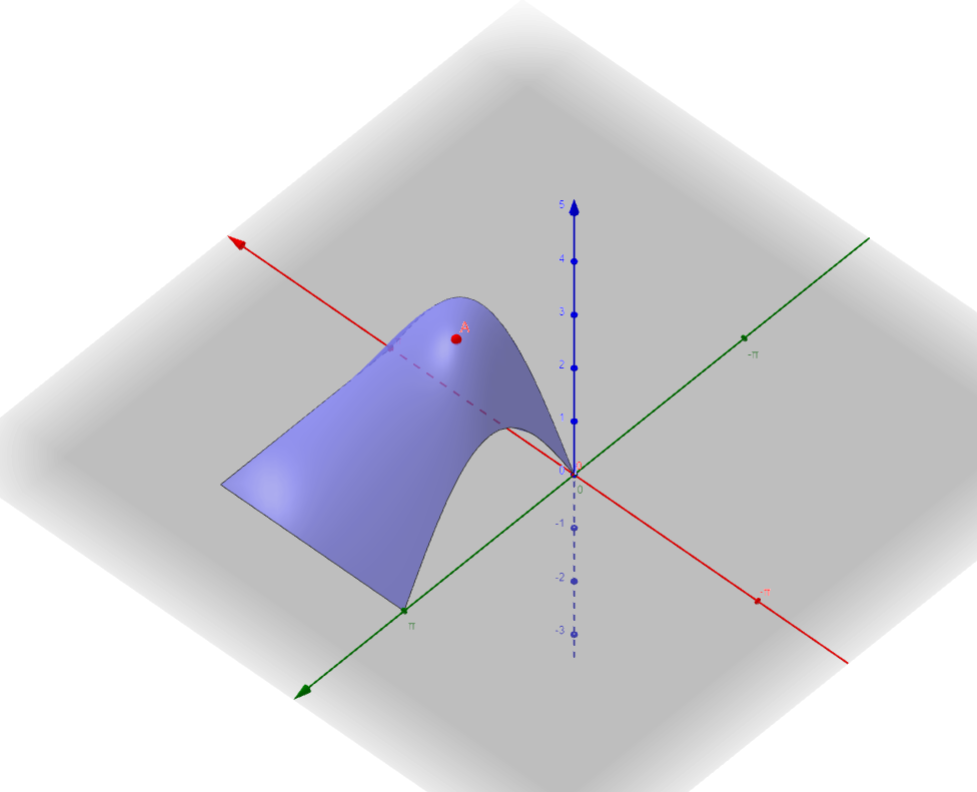

# Aufgabe 363
## Angabe

Man bestimme alle relativen Extrema und Sattelpunkte der Funktion $f(x, y)$ im
Inneren des angegebenen Bereichs und alle absoluten Extrema im gesamten, angegebenen
Bereich. Hinweis: Eine symmetrische 2x2-Matrix ist genau dann indefinit, wenn ihre Determinante negativ ist.

$f(x,y)=\sin{(x+y)}+\sin{(x)}+\sin{(y)}$ für $0 \le x,y \le \pi$

## Hilfreiches

**Satz 3.85 (Hauptminorenkriterium)** \
Eine symmetrische Matrix $G=(g_{ij}) \in \R^{n \times n}$ ist genau dann positiv definit, wenn alle Hauptminoren 

$M_k = \begin{vmatrix}g_{11} & \cdots & g_{1k} \\ \vdots & & \vdots \\ g_{k1} & \cdots & g_{kk} \end{vmatrix} \quad (1 \le k \le n)$

positiv sind. $G$ ist genau dann negativ definit, wenn $M_k$ für gerades $k$ positiv und für ungerades $k$ negativ ist.

**Definition 6.31**

Sei $D \subseteq \R^n$ und $f:D \to \R$. Die Funktion $f$ besitzt an der Stelle $x_0 \in D$ ein relatives (oder lokales) Maximum (bzw. Minimum), wenn es eine Umgebung $U_\varepsilon(x_0)$ gibt, so dass für alle $x \in U_\varepsilon(x_0) \cap D$ gilt: $f(x)\le f(x_0)$ (bzw. $f(x) \ge f(x_0)$) .

Eine Stelle $x_0$ heißt absolutes (oder globales) Maximum (bzw. Minimum) von $f$, falls diese Ungleichung für alle $x \in D$ gilt.

**Satz 6.32** (notwendige Bedingung für Extrema)

Sei $D \subseteq \R^n$ eine offene Menge und $f:D\to\R$. Die Funktion $f$ habe in $x$ ein relatives Extremum und sei darüber hinaus in $x$ partiell differenzierbar. Dann verschwindet in $x$ alle partiellen Ableitungen, d.h. $\operatorname{grad} f(x)=0$.

Punkte mit $\operatorname{grad} f(x)=0$ heißen stationäre Punkte.

**Satz 6.34** (hinreichende Bedingung für Extrema)

Sei $D \subseteq \R^n$ eine offene Menge und $f:D \to \R$. Weiters sei $x_0 \in D$ ein Punkt mit $\operatorname{grad} f(x)=0$. Bezeichne $H(x)$ die Hesse-Matrix von $f$ in $x$. Falls $H(x_0)$ negativ definit ist, so liegt bei $x_0$ ein relatives Maximum vor. Im positiv definiten Fall liegt ein relatives Minimum vor. Ist $H(x_0)$ indefinit, so ist an der Stelle $x_0$ kein Extremum, sondern ein Sattelpunkt von $f$.

## Lösungsvorschlag

$f(x,y)=\sin{(x+y)}+\sin{x}+\sin{y}$ für $0 \le x,y \le \pi$

### Skizze

### Partielle Ableitungen 1. Ordnung

$f_x(x,y)=\cos{(x+y)}\cdot 1 + \cos{(x)}$ \
$f_y(x,y)=\cos{(x+y)}\cdot 1 + \cos{(y)}$

### Stationäre Punkte

$\operatorname{grad} f(x)=0$

$\begin{pmatrix}f_x(x,y) \\ f_y(x,y) \end{pmatrix}=\begin{pmatrix}0 \\ 0 \end{pmatrix}$

$\begin{pmatrix}\cos{(x+y)}\cdot 1 + \cos{(x)} \\ \cos{(x+y)}\cdot 1 + \cos{(y)} \end{pmatrix}=\begin{pmatrix}0 \\ 0 \end{pmatrix}$

$\cos{(x+y)} + \cos{(x)}=0$ \
$\cos{(x+y)} + \cos{(y)}=0$

$\cos{(x+y)} =-\cos{(x)}$ \
$\cos{(x+y)}=-\cos{(y)}$

$-\cos{(x)}=-\cos{(y)}$
$x=\pm y$

**Fall x=y**\
$\cos{(2x)} + \cos{(x)}=0$

Doppelwinkelfunktion: \
$\cos{(2x)}=\cos^2{(x)}-\sin^2{(x)}$

Trigonometrischer Pythagoras: \
$\sin^2{(x)}+\cos^2{(x)}=1$ \
$\sin^2{(x)}=1-\cos^2{(x)}$

$\cos^2{(x)}-\sin^2{(x)} + \cos{(x)}=0$ \
$\cos^2{(x)}-(1-\cos^2{(x)}) + \cos{(x)}=0$ \
$2\cos^2{(x)} + \cos{(x)}-1=0$ 

Substitution: $u=\cos{(x)}$

$2u^2 + u-1=0$ 

$\displaystyle u_{1,2}=\frac{-1 \pm \sqrt{1^2-4\cdot 2\cdot (-1)}}{2\cdot 2}$

$\displaystyle u_{1,2}=\frac{-1 \pm \sqrt{9}}{4}$

$\displaystyle u_{1,2}=\frac{-1 \pm 3}{4} \implies u_1=\frac{1}{2},\quad u_2=-1$

Rücksubstitution: 

$\displaystyle \frac{1}{2}=\cos{(x_1)} \iff x_1=\frac{\pi}{3}$

$-1=\cos{(x_2)} \iff x_2=\pi$

**Fall x=-y** \
$\cos{(-y+y)} =-\cos{(-y)}$ \
$\cos{(0)} =-\cos{(-y)}$ \
$1=-\cos(-y)$

Symmetrie: \
$\cos{(-x)}=+\cos{(x)}$

1=$-\cos{(y)}$ \
$-1=\cos{(y)}$ \
$y=\pi$

Punkt $(-\pi, \pi)$ außerhalb vom Definitionsbereich und muss daher nicht weiter untersucht werden.

Damit ergeben sich folgende Stationäre Punkte: \
$(\frac{\pi}{3},\frac{\pi}{3}),\quad (\pi,\pi)$

### Partielle Ableitungen 2. Ordnung 

$f_x(x,y)=\cos{(x+y)} + \cos{(x)}$ \
$f_y(x,y)=\cos{(x+y)}+ \cos{(y)}$

$f_{xx}(x,y)=-\sin{(x+y)}\cdot 1-\sin{(x)}$ \
$f_{xy}(x,y)=-\sin{(x+y)}\cdot 1$ \
$f_{yy}(x,y)=-\sin{(x+y)}\cdot 1-\sin{(y)}$

### lokales Extrema oder Sattelpunkt?

Hesse-Matrix: \
$H=\begin{pmatrix}f_{xx} & f_{xy} \\ f_{xy} & f_{yy}\end{pmatrix}$

**x=$\frac{\pi}{3}$, y=$\frac{\pi}{3}$**

$\sin{(\frac{\pi}{3})}=\sin{(\frac{2\pi}{3})}=\frac{\sqrt{3}}{2}$

$f_{xx}(\frac{\pi}{3},\frac{\pi}{3})=-\sin{(\frac{2\pi}{3})}-\sin{(\frac{\pi}{3})}=-\sqrt{3}$ \
$f_{xy}(\frac{\pi}{3},\frac{\pi}{3})=-\sin{(\frac{2\pi}{3})}=-\frac{\sqrt{3}}{2}$ \
$f_{yy}(\frac{\pi}{3},\frac{\pi}{3})=-\sin{(\frac{2\pi}{3})}-\sin{(\frac{\pi}{3})}=-\sqrt{3}$

$H(\frac{\pi}{3},\frac{\pi}{3})=\begin{pmatrix}-\sqrt{3} & -\frac{\sqrt{3}}{2} \\ -\frac{\sqrt{3}}{2} & -\sqrt{3}\end{pmatrix}$ 

$M_1=\begin{vmatrix}-\sqrt{3}\end{vmatrix}=-\sqrt{3}<0$

$M_2=\begin{vmatrix}-\sqrt{3} & -\frac{\sqrt{3}}{2} \\ -\frac{\sqrt{3}}{2} & -\sqrt{3}\end{vmatrix}=\underbrace{((-\sqrt{3})\cdot (-\sqrt{3}))}_{3}-\underbrace{((-\frac{\sqrt{3}}{2})\cdot (-\frac{\sqrt{3}}{2}))}_{\frac{3}{4}}=\frac{9}{4}>0$

$\implies H(\frac{\pi}{3},\frac{\pi}{3})$ negativ definit $\implies (\frac{\pi}{3},\frac{\pi}{3})$ ist ein relatives Maximum

**x=$\pi$, y=$\pi$**

$\sin{(\pi)}=\sin{(2\pi)}=0$

$f_{xx}(\pi,\pi)=-\sin{(2\pi)}-\sin{(\pi)}=0$ \
$f_{xy}(\pi,\pi)=-\sin{(2\pi)}=0$ \
$f_{yy}(\pi,\pi)=-\sin{(2\pi)}-\sin{(\pi)}=0$

$H(\pi,\pi)=\begin{pmatrix}0 & 0 \\ 0 & 0\end{pmatrix}$ 

$\implies H(\pi,\pi)$ semi definit $\implies (\pi,\pi)$ in seiner Umgebung betrachten

$f(x,y)=\sin{(x+y)}+\sin{(x)}+\sin{(y)}$ \
$f(\pi,\pi)=\sin{(2\pi)}+\sin{(\pi)}+\sin{(\pi)}=0$

Angenommen: $\varepsilon > 0 \land \varepsilon < \frac{\pi}{2}$

$f(\pi+\varepsilon ,\pi + \varepsilon)=\sin{(2(\pi+\varepsilon))}+\sin{(\pi+ \varepsilon)}+\sin{(\pi + \varepsilon)}$ \
$f(\pi-\varepsilon ,\pi - \varepsilon)=\sin{(2(\pi-\varepsilon))}+\sin{(\pi- \varepsilon)}+\sin{(\pi - \varepsilon)}$ 

Doppelwinkelfunktion: \
$\sin{(2x)}=2\sin{(x)}\cdot \cos{(x)}$

Rückführung auf spitze Winkel: \
$\sin{(\pi+x)}=-\sin{(x)}$ \
$\sin{(\pi - x)} = \sin{(x)}$

$\cos{(\pi+x)}=-\cos{(x)}$ \
$\cos{(\pi - x)}=-\cos{(x)}$

$f(\pi+\varepsilon ,\pi + \varepsilon)=2 \sin{(\pi+\varepsilon)} \cdot \cos{(\pi+\varepsilon)}+\sin{(\pi+ \varepsilon)}+\sin{(\pi + \varepsilon)}$\
$f(\pi+\varepsilon ,\pi + \varepsilon)=2\cdot (-\sin{(\varepsilon)}) \cdot (-\cos{(\varepsilon)})-\sin{(\varepsilon)}-\sin{(\varepsilon)}$ \ 
$f(\pi+\varepsilon ,\pi + \varepsilon)=2\cdot(\underbrace{\sin{(\varepsilon)} \cdot \cos{(\varepsilon)}-\sin{(\varepsilon)}}_{>0}) < 0$ 

$f(\pi-\varepsilon ,\pi - \varepsilon)=2\sin{(\pi-\varepsilon)} \cdot \cos{(\pi-\varepsilon)}+\sin{(\pi- \varepsilon)}+\sin{(\pi - \varepsilon)}$ \
$f(\pi-\varepsilon ,\pi - \varepsilon)=2\sin{(\varepsilon)} \cdot (-\cos{(\varepsilon)})+\sin{(\varepsilon)}+\sin{(\varepsilon)}$ \
$f(\pi-\varepsilon ,\pi - \varepsilon)=-2\cdot (\underbrace{\sin{(\varepsilon)} \cdot \cos{(\varepsilon)}+\sin{(\varepsilon)}}_{<0})>0$

Der Punkt $(\pi,\pi)$ hat in seiner Umgebung Funktionswerte, die sowohl größer als auch kleiner sind und ist daher ein Sattelpunkt. 

