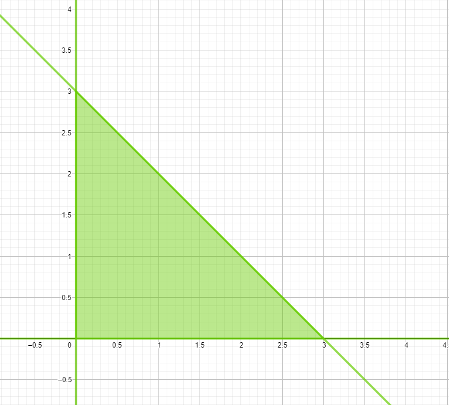
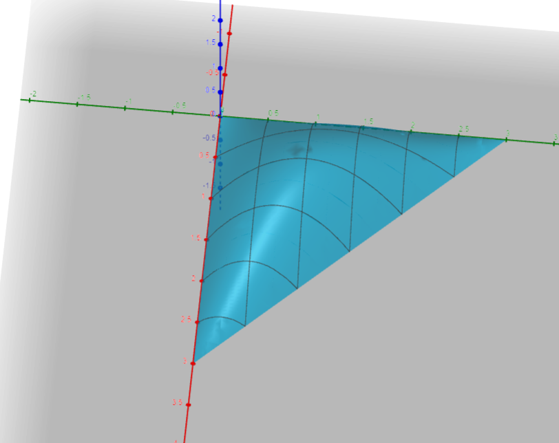

# Aufgabe 370
## Angabe

Gesucht ist das absolute Maximum der Funktion $f(x,y)=xy(3-x-y)$ auf dem Definitionsbereich $D=\{(x,y)|x\ge0,y\ge0,y\le3-x\}$

(Anleitung: Man skizziere den Definitionsbereich $D$ in der $(x, y)$-Ebene, bestimme dessen
Rand und ermittle alle Funktionswerte auf dem Rand. Das absolute Maximum ist dann
unter den relativen Maxima im Inneren von $D$ sowie unter den Funktionswerten am Rand
von $D$ zu suchen.)

## Hilfreiches

**Satz 3.85 (Hauptminorenkriterium)** \
Eine symmetrische Matrix $G=(g_{ij}) \in \R^{n \times n}$ ist genau dann positiv definit, wenn alle Hauptminoren 

$M_k = \begin{vmatrix}g_{11} & \cdots & g_{1k} \\ \vdots & & \vdots \\ g_{k1} & \cdots & g_{kk} \end{vmatrix} \quad (1 \le k \le n)$

positiv sind. $G$ ist genau dann negativ definit, wenn $M_k$ für gerades $k$ positiv und für ungerades $k$ negativ ist.

**Definition 6.31**

Sei $D \subseteq \R^n$ und $f:D \to \R$. Die Funktion $f$ besitzt an der Stelle $x_0 \in D$ ein relatives (oder lokales) Maximum (bzw. Minimum), wenn es eine Umgebung $U_\varepsilon(x_0)$ gibt, so dass für alle $x \in U_\varepsilon(x_0) \cap D$ gilt: $f(x)\le f(x_0)$ (bzw. $f(x) \ge f(x_0)$) .

Eine Stelle $x_0$ heißt absolutes (oder globales) Maximum (bzw. Minimum) von $f$, falls diese Ungleichung für alle $x \in D$ gilt.

**Satz 6.32** (notwendige Bedingung für Extrema)

Sei $D \subseteq \R^n$ eine offene Menge und $f:D\to\R$. Die Funktion $f$ habe in $x$ ein relatives Extremum und sei darüber hinaus in $x$ partiell differenzierbar. Dann verschwindet in $x$ alle partiellen Ableitungen, d.h. $\operatorname{grad} f(x)=0$.

Punkte mit $\operatorname{grad} f(x)=0$ heißen stationäre Punkte.

**Satz 6.34** (hinreichende Bedingung für Extrema)

Sei $D \subseteq \R^n$ eine offene Menge und $f:D \to \R$. Weiters sei $x_0 \in D$ ein Punkt mit $\operatorname{grad} f(x)=0$. Bezeichne $H(x)$ die Hesse-Matrix von $f$ in $x$. Falls $H(x_0)$ negativ definit ist, so liegt bei $x_0$ ein relatives Maximum vor. Im positiv definiten Fall liegt ein relatives Minimum vor. Ist $H(x_0)$ indefinit, so ist an der Stelle $x_0$ kein Extremum, sondern ein Sattelpunkt von $f$.

## Lösungsvorschlag

### Skizze vom Definitionsbereich

### Funktionswerte am Rand

$x=0$ \
$y=0$ \
$y=3-x$

$f(x,y)=xy(3-x-y)$
$f(0,t)=0\cdot t \cdot (3-0-t)=0$ \
$f(t,0)=t\cdot 0\cdot (3-t-0)=0$ \
$f(t,3-t)=t \cdot (3-t)\cdot (3-t-(3-t))=0$

### Partielle Ableitungen 1. Ordnung

$f(x,y)=xy(3-x-y)$

3er Produktregel: \
$(a\cdot b)'\cdot c+(a\cdot b)\cdot c'$ \
$(a' \cdot b + a \cdot b')\cdot c+(a\cdot b)\cdot c'$ \
$\textcolor{springgreen}{a'bc}+\textcolor{cyan}{ab'c}+\textcolor{orange}{abc'}$

$f_x(x,y)=\textcolor{springgreen}{1\cdot y\cdot (3-x-y)}+\textcolor{cyan}{x\cdot 0 \cdot (3-x-y)}+\textcolor{orange}{x\cdot y\cdot (-1)}$ \
$f_x(x,y)=y\cdot (3-x-y)+x\cdot y\cdot (-1)$ \
$f_x(x,y)=-y^2-2xy+3y$ 

$f_y(x,y)=\textcolor{springgreen}{0\cdot y\cdot (3-x-y)}+\textcolor{cyan}{x\cdot 1\cdot (3-x-y)}+\textcolor{orange}{x\cdot y\cdot (-1)}$ \
$f_y(x,y)=x\cdot (3-x-y)+x\cdot y\cdot (-1)$ \
$f_y(x,y)=-x^2-2xy+3x$ 

### Stationäre Punkte

$\operatorname{grad} f(x)=0$

$\begin{pmatrix}f_x(x,y) \\ f_y(x,y) \end{pmatrix}=\begin{pmatrix}0 \\ 0 \end{pmatrix}$

$\begin{pmatrix}-y^2-2xy+3y \\ -x^2-2xy+3x \end{pmatrix}=\begin{pmatrix}0 \\ 0 \end{pmatrix}$

**Gleichungssystem lösen**

$y\cdot (-y-2x+3)=0$ \
$x\cdot (-x-2y+3)=0$ 

Eine Lösung lässt sich sehr leicht ablesen: $x=0, y=0$ 

**Fall $x=0,y\neq 0$:**

$(-y-2\cdot 0 +3)=0$ \
$y=3$

**Fall $x\neq 0, y=0$**

$(-x-2\cdot 0 +3)=0$ \
$y=3$

**Fall $x\neq0, y\neq0$**

$-y-2x+3=0$ \
$y=-2x+3$ 

$-x-2y+3=0$ \
$-x-2\cdot (-2x+3)=0$ \
$-x + 4x-6+3=0$ \
$3x-3=0$ \
$x=1$

$y=-2\cdot 1+3$ \
$y=1$

Damit ergeben sich folgende Stationäre Punkte: \
$(0,0),\quad (0,3),\quad (3,0), \quad(1,1)$

### Partielle Ableitungen 2. Ordnung 

$f_x(x,y)=-y^2-2xy+3y$ \
$f_y(x,y)=-x^2-2xy+3x$

$f_{xx}(x,y)=-2y$ \
$f_{xy}(x,y)=-2y-2x+3$ \
$f_{yy}(x,y)=-2x$

### lokales Extrema oder Sattelpunkt?

Hesse-Matrix: \
$H=\begin{pmatrix}f_{xx} & f_{xy} \\ f_{xy} & f_{yy}\end{pmatrix}$

**x=0,y=0**

$f_{xx}(0,0)=-2\cdot 0= 0$ \
$f_{xy}(0,0)=-2\cdot 0-2\cdot 0+3 = 3$ \
$f_{yy}(0,0)=-2 \cdot 0=0$

$H(0,0)=\begin{pmatrix}0 & 3 \\ 3 & 0\end{pmatrix}$ 

$M_1=\begin{vmatrix}0\end{vmatrix}=0$

$M_2=\begin{vmatrix}0 & 3 \\ 3 & 0\end{vmatrix}=(0 \cdot 0)-(3\cdot 3)=-9<0$

$\implies H(0,0)$ indefinit $\implies (0,0)$ ist ein Sattelpunkt

**x=0,y=3**

$f_{xx}(0,3)=-2\cdot 3=-6$ \
$f_{xy}(0,3)=-2 \cdot 3-2 \cdot 0+3=-3$ \
$f_{yy}(0,3)=-2 \cdot 0=0$

$H(0,3)=\begin{pmatrix}-6 & -3 \\ -3 & 0\end{pmatrix}$ 

$M_1=\begin{vmatrix}-6\end{vmatrix}=-6<0$

$M_2=\begin{vmatrix}-6 & -3 \\ -3 & 0\end{vmatrix}=(-6\cdot 0)-(-3\cdot (-3))=-9<0$

$\implies H(0,3)$ indefinit $\implies (0,3)$ ist ein Sattelpunkt

**x=3,y=0**

$f_{xx}(3,0)=-2\cdot 0=0$ \
$f_{xy}(3,0)=-2\cdot 0-2\cdot 3+3=-3$ \
$f_{yy}(3,0)=-2\cdot 3=-6$

$H(3,0)=\begin{pmatrix}0 & -3 \\ -3 & -6\end{pmatrix}$ 

$M_1=\begin{vmatrix}0\end{vmatrix}=0$

$M_2=\begin{vmatrix}0 & -3 \\ -3 & -6\end{vmatrix}=(0\cdot (-6))-(-3\cdot (-3))=-9<0$

$\implies H(3,0)$ indefinit $\implies (3,0)$ ist ein Sattelpunkt

**x=1,y=1**

$f_{xx}(1,1)=-2\cdot 1=-2$ \
$f_{xy}(1,1)=-2\cdot 1-2\cdot 1+3=-1$ \
$f_{yy}(1,1)=-2\cdot 1=-2$

$H(1,1)=\begin{pmatrix}-2 & -1 \\ -1 & -2\end{pmatrix}$ 

$M_1=\begin{vmatrix}-2\end{vmatrix}=-2<0$

$M_2=\begin{vmatrix}-2 & -1 \\ -1 & -2\end{vmatrix}=((-2)\cdot (-2))-((-1)\cdot (-1))=3>0$

$\implies H(1,1)$ negativ definit $\implies (1,1)$ ist ein relatives Maximum

### Globales Maximum?

$f(x,y)=xy(3-x-y)$

Funktionswert am Rand: 0

$f(1,1)=1\cdot 1\cdot (3-1-1)=1$

### Skizze

