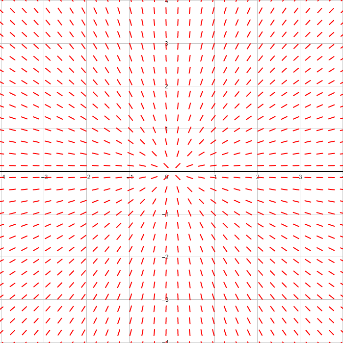

# Aufgabe 373
## Angabe

Man ermittle das Richtungsfeld der Differentialgleichung $y'=\frac{y}{x}$ und überlege, ob es durch jeden Punkt der $(x,y)$-Ebene genau eine Lösung der Gleichung gibt.

## Hilfreiches

Seite 310 im Buch

Im Fall einer expliziten Differentialgleichung erster Ordnung der Form $y'=f(x,y)$ kann das Auffinden von Lösungen geometrisch anschaulich gedeutet werden: Durch $y'=f(x,y)$ wird jedem Punkt $(x_0,y_0)$ der Ebene eine Richtung $y'_0=f(x_0,y_0)$ zugeordnet, welche den Anstieg der Tangente an die Lösungkurve durch $(x_0,y_0)$ angibt. 

Zeichnet man in jedem Punkt $(x_0,y_0)$ eine kurze Strecke mit der Steigung $y'_0$, so entsteht das sogenannte Richtungsfeld der Differentialgleichung. Einzelne Punkte und zugehörige Richtungen, also Tripel der Form $(x_0,y_0,y'_0)$ werden als Linienelemente bezeichnet. 

Die Gesamtheit aller Linienelemente bilden das Richtungsfeld. Nun ist $y=y(x)$ genau dann eine Lösungskurve der Differentialgleichung, wenn in jedem Kurvenpunkt das dort zugeordnete Linienelement tangential verläufft. 

Geometrisch besteht die Aufgabe, alle Lösungen der Gleichung zu finden, also darin, geeignete Kurven in das Richtungsfeld der Gleichung "einzupassen".

**Satz 7.31 (Existenz- und Eindeutigkeitssatz)**

Ist $f(x,y)$ eine stetige Funktion auf dem Rechtecksbereich $D \subseteq \R^2$ und erfüllt dort eine so genannte Lipschitzbedingung

$|f(x,y_1)-f(x,y_2)|\le L \cdot |y_1-y_2|$ für alle $x,y_1,y_2$

mit einer von $x,y_1$ und $y_2$ unabhängigen Konstanten $L>0$, dann besitzt die Differentialgleichung $y'=f(x,y)$ durch jeden Punkt $(x_0,y_0) \in D$ genau eine Lösung $y=y(x)$.

"Wenn das $y_1$ nahe genug beim $y_2$ ist, dann soll das $f(x,y_1)$ nahe beim $f(x,y_2)$ sein." - Karigl 2020W

## Lösungsvorschlag

### Richtungsfeld

### Existenz und Eindeutigkeit einer Lösung

$\displaystyle f(x,y)=\frac{y}{x}$

Bei $x=0$ ist die Funktion nicht definiert, weswegen alle Punke der Form $(0,y)$ wegfallen.

Für alle anderen Punkte $(x,y),x \neq 0$ schauen wir uns die Lipschitzbedingung an:

$|f(x,y_1)-f(x,y_2)|\le L \cdot |y_1-y_2|$

$\displaystyle \left|\frac{y_1}{x}-\frac{y_2}{x}\right|\le L \cdot |y_1-y_2|$

$\displaystyle \left|\frac{1}{x}\cdot (y_1-y_2)\right|\le L \cdot |y_1-y_2|$

$\displaystyle \left|\frac{1}{x}\right| \cdot \cancel{|y_1-y_2|}\le L \cdot \cancel{|y_1-y_2|}$

$\displaystyle \left|\frac{1}{x}\right| \le L$

Gibt es so eine Konstante $L$, die immer $\displaystyle \left|\frac{1}{x}\right|$ von oben beschränkt?

$\displaystyle \lim_{x \to 0} \left|\frac{1}{x}\right|=\infin$

Man kann daher in der Nähe von $x=0$ keine obere Schranke finden. 

Deswegen kann man auch keine konstante $L$ finden, bei der die Ungleichung wahr ist.

Es gibt also nach dem Existenz- und Eindeutigkeitssatz keine eindeutige Lösung für jeden Punkt der Ebene.

