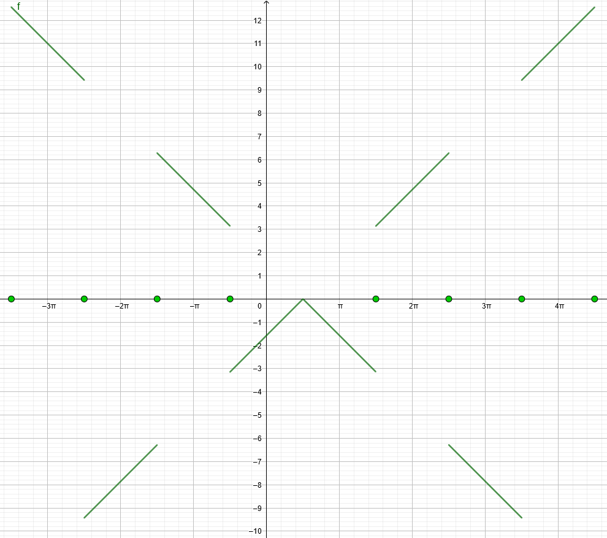

# Aufgabe 115
## Angabe

Man zeichne den Graphen der Funktion $f(x)$ und bestimme alle Stellen, an denen
$f(x)$ stetig ist.

$$
\displaystyle
\left(
sgn(x):=
\begin{cases}
+1 & \text{ für } x > 0 \\
-1 & \text{ für } x < 0 \\
0 & \text{ für } x = 0 \\ 
\end{cases}
\right)
$$

$f(x) = (x-\frac{\pi}{2}) \cdot sgn(\cos{x})$

## Hilfreiches

**Definition 4.84**:
Eine Funktion $f: D \to \R$ heißt stetig an der Stelle $x_0 \in D$, wenn $f(x_0)=\lim_{x \to x_0}f(x)$. Die Funktion $f$ heißt stetig in $D$, wenn $f$ an jeder Stelle $x_0 \in D$ stetig ist. 

Bemerkung: Stetigkeit bedeutet also nichts anderes, als dass man Grenzwertbildung und Funktionsauswertung miteinander vertauschen kann. Eine Funktion ist genau dann stetig an der Stelle $x_0$, wenn $\lim_{x \to x_0}f(x) = f(lim_{x \to x_0}x)$ gilt.

**Definition 4.85**:
Eine Funktion $f: D\to \R$ heißt stetig an der Stelle $x_0 \in D$, wenn 

$\forall \varepsilon > 0: \exists\delta=\delta(\varepsilon) > 0: (|x-x_0| < \delta \implies |f(x)-f(x_0)|<\varepsilon)$

## Lösungsansatz

### Skizze

### Funktionswerte

#### Fall $cos(x) = 0$
Bei $x = \frac{\pi}{2} + k \cdot \pi$ mit $k \in \Z$

$f(x) = (x-\frac{\pi}{2}) \cdot sgn(\cos(x))$

$f(x) = (x-\frac{\pi}{2}) \cdot sgn(0)$

$f(x) = (x-\frac{\pi}{2}) \cdot 0$

$f(x) = 0$

#### Fall $cos(x) > 0$
Bei $-\frac{\pi}{2} \lt x \lt \frac{\pi}{2}$

$f(x) = (x-\frac{\pi}{2}) \cdot sgn(\cos(x))$

$f(x) = (x-\frac{\pi}{2}) \cdot 1$

#### Fall $cos(x) < 0$
Bei $\frac{\pi}{2} \lt x \lt \frac{3\pi}{2}$

$f(x) = (x-\frac{\pi}{2}) \cdot sgn(\cos(x))$

$f(x) = (x-\frac{\pi}{2}) \cdot -1$

### Wohldefiniert für alle $x$
$f(x) = (x-\frac{\pi}{2}) \cdot sgn(\cos(x))$

Ja, ist wohldefiniert. Siehe auch: Fallunterscheidung

$\implies \text{ keine Lücken}$

### Sprünge (nicht stetig)

Innerhalb der einzelnen Fälle ist die Funktion stetig (weil sie aus Elementaren stetigen Funktionen besteht die so verknüpft werden, dass es immer noch stetig bleibt)

#### Fall $cos(x) = 0$
Immer ein Sprung, siehe auch: Graphen

Ausnahme: $x = \frac{\pi}{2}$, weil da die anderen Fälle auch zu $0$ werden
$f(x) = (x-\frac{\pi}{2}) \cdot 1$

$f(x) = (x-\frac{\pi}{2}) \cdot -1$

$\implies \text{Sprünge bei } x = \frac{\pi}{2} + k \cdot \pi$ mit $k \in \Z$

#### Fall $cos(x) > 0$ und $cos(x) < 0$
$f(x) = (x-\frac{\pi}{2}) \cdot 1$

$f(x) = (x-\frac{\pi}{2}) \cdot -1$

Es ist immer ein Sprung wenn es vom positiven ins negative oder umgekehrt wechselt. Jedoch ist da immer $cos(x) = 0$ dazwischen, womit diese Fälle schon durch den oberen Fall abgedeckt werden?

$\implies \text{Sprünge bei } x = \frac{\pi}{2} + k \cdot \pi$ mit $k \in \Z$