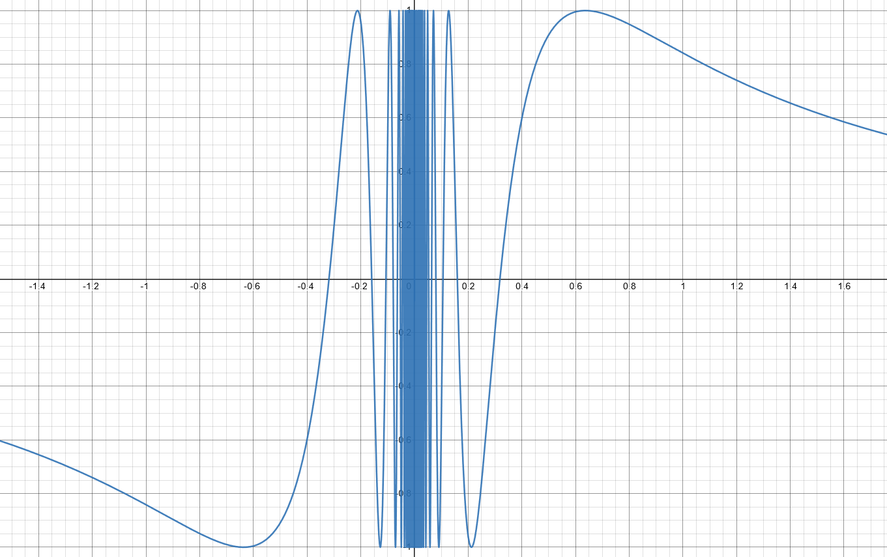

# Aufgabe 119
## Angabe

Man skizziere den Verlauf der Funktion $f \colon \R \setminus \{0\} \to \R, f(x) = \sin{(1/x)}$ und
beweise, dass $f(x)$ an der Stelle $x = 0$ keinen Grenzwert besitzt, indem man die beiden
Folgen $\displaystyle x_n = \frac{1}{n \pi}$ und $\displaystyle x_n = \frac{1}{2nπ + \frac{π}{2}}$ betrachtet.

## Hilfreiches

**Definition 4.82**:

Eine Funktion $f:D\to \R$ mit $D \subseteq \R$ besitzt an der Stelle $x_0$ den Grenzwert $c (c \in \R)$, wenn für jede Folge $(x_n)_{n \ge 1}$ $(x_n \in D)$ mit $x_n\neq x_0$ und $\lim_{n \to \infin} x_n=x_0$ folgt, dass $\lim_{n \to \infin} f(x_n)=c$. Man schreibt dann $\lim_{x \to x_0}f(x)=c$. Falls aus $x_n \to \infin$ folgt, dass $f(x_n) \to c$, dann ist $\lim_{x \to \infin}f(x)=c$. In Fällen $c=-\infin$ und $c=+\infin$ spricht man von einem uneigentlichen Grenzwert an der Stelle $x_0$.

Eine Funktion $f$ besitzt an der Stelle $x_0$ den rechtsseitigen Grenzwert $c$, wenn für jede Folge $(x_n)$ mit $x_n>x_0$ und $\lim_{n \to \infin} x_n=x_0$ folgt, dass $\lim_{n \to \infin} f(x_n)=c$. Man schreibt auch: $\lim_{x\to x_0+}f(x)=c$.

Analog sind der linksseitige Grenzwert $\lim_{x \to x_0-}f(x)$ sowie uneigentliche einseitige Grenzwerte definiert.

## Lösungsweg

### Skizze 

### Nullfolgen überprüfen

$\displaystyle \lim_{n \to \infin}(x_n)=\lim_{n \to \infin} \frac{1}{n\pi}=0$

$\displaystyle \lim_{n \to \infin}(x_n)=\lim_{n \to \infin} \frac{1}{2n\pi+\frac{\pi}{2}}=0$

### In die Funktion einsetzen und den Grenzwert bestimmen

$\displaystyle \lim_{n \to \infin} \sin{\frac{1}{x_n}}=\lim_{n \to \infin} \sin{(n\pi)}=0$, denn $\sin{(n\pi)}=0$ für alle $n \in \N$ 

$\displaystyle \lim_{n \to \infin} \sin{\frac{1}{x_n}}=\lim_{n \to \infin} \sin{(2n\pi+\frac{\pi}{2})}=1$, denn $\sin{(2n\pi+\frac{\pi}{2})}=1$ für alle $n \in \N$ 

$\displaystyle 0 \neq 1 \implies \lim_{x \to 0}f(x)$ existiert nicht.
