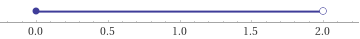

# Aufgabe 96
## Angabe

Man untersuche, für welche $x \in \R$ die folgende Funktionenreihe konvergiert:

$\displaystyle \sum_{n=1}^\infin \frac{1}{2n-1}(x-1)^n$

## Hilfreiches

**Satz 4.59**:

Sei $\sum_{n \ge 0} a_n (x-x_0)^n$ eine Potenzreihe. Dann existiert ein $R$ mit $0 \le R \le \infin$, so dass die Reihe für alle $x \in \Complex$ mit $|x-x_0| < R$ absolut konvergent und für alle $x \in \Complex$ mit $|x-x_0| > R$ divergent ist. Der Konvergenzbereich der Potenzreihe ist somit ein Kreis in der Gauß'schen Zahlenebene mit dem Radius $R$. Die Zahl $R$ heißt Konvergenzradius der Reihe und kann mit der Formel

$\displaystyle \quad R=\frac{1}{\limsup_{n\to\infin}\sqrt[n]{|a_n|}}$

berechnet werden.

Bemerkung:
 
1. Falls $\limsup_{n\to\infin}\sqrt[n]{|a_n|} = \infin$, so ist $R = 0$ zu setzen. Die Potenzreihe konvergiert dann nur für $x=0$. Im Fall $\limsup_{n\to\infin}\sqrt[n]{|a_n|} = 0$ gilt $R=\infin$, d.h., das Konvergenzgebiet ist dann die gesamte Gauß'sche Zahlenebene.  
2. Wie bereits in einigen voran gehenden Beispielen (4.54a, 4.58) kann der Konvergenzradius in vielen Fällen sehr einfach (auch) mit dem Quotientenkriterium in Limesform berechnet werden.

**Satz 4.41 (Konvergenzkriterium von Leibniz)**:
Eine alternierende Reihe $\sum_{n \ge 0}(-1)^n a_n$, für die $(a_n)_{n \ge0}$ eine monoton fallende Nullfolge ist, ist konvergent.

**Satz 4.48 (Minorantenkriterium)**:
Seien $\sum_n a_n$ und $\sum_n b_n$ zwei Reihen, so dass $0 \le a_n \le b_n$ für fast alle $n$. Falls $\sum_n a_n$ divergent ist, so ist auch die Reihe $\sum_n b_n$ divergent.

Außerdem:

$\displaystyle \lim_{n \to \infin} \sqrt[n]{c}=1$ für alle $c \in \N$

## Lösungsansatz

$\displaystyle \sum_{n=1}^\infin \frac{1}{2n-1}(x-1)^n$

$\displaystyle x_0=1, \quad a_n = \frac{1}{2n-1}$

$\displaystyle R=\frac{1}{\lim_{n\to\infin}\sqrt[n]{|a_n|}}$

### Konvergenzradius

**Wurzelkriterium**:

$\displaystyle \lim_{n \to \infin} \sqrt[n]{\left|\frac{1}{2n-1}\right|} =\lim_{n\to\infin}\frac{\sqrt[n]{|1|}}{\sqrt[n]{|2n-1|}}= \frac{1}{\lim_{n \to \infin} \sqrt[n]{|2n-1|}}$

$\lim_{n \to \infin} \sqrt[n]{2n-1}$

Sandwich-Theorem

$\sqrt[n]{n} \le \sqrt[n]{2n-1} \le \sqrt[n]{2n}$

$\displaystyle \lim_{n \to \infin} \sqrt[n]{n}=1$

$\displaystyle \lim_{n \to \infin} \sqrt[n]{2n}=\lim_{n \to \infin} \sqrt[n]{2}\sqrt[n]{n}=1\cdot1=1$

$\implies \lim_{n \to \infin} \sqrt[n]{2n-1} = 1$

**Quotientenkriterium**:

$\displaystyle \lim_{n\to\infin}\left|\frac{\frac{1}{2(n+1)-1}}{\frac{1}{2n-1}}\right|=\lim_{n \to \infin}\left|\frac{2n-1}{2(n+1)-1}\right|=\lim_{n \to \infin}\left|\frac{2n-1}{2n+1}\right|=\lim_{n \to \infin}\left|\frac{n(2-\frac{1}{n})}{n(2+\frac{1}{n})}\right|=\lim_{n \to \infin}\left|\frac{2-\frac{1}{n}}{2+\frac{1}{n}}\right|=\left|\frac{2-0}{2+0}\right|=1$

$\displaystyle R=\frac{1}{1}=1$

$|x-1|<1 \implies \text{ konvergiert absolut}$

**Fallunterscheidung**:

$(x-1) < 1 \iff x < 2$ für $x \ge 1$ 

$-(x-1) < 1 \iff x > 0$ für $x < 1$

Für $0 < x < 2$ konvergiert die Reihe absolut.\
Für $x < 0$ und $x > 2$ divergiert die Reihe.

### Randfälle

$x=0$:

$\displaystyle \sum_{n=1}^\infin \frac{1}{2n-1}(-1)^n$

**Konvergenzkriterium von Leibniz**:
- alternierende Reihe $\checkmark$
- Nullfolge $\checkmark$
- monoton fallend $\checkmark$

$$
\begin{aligned}
\frac{1}{2n-1} &> \frac{1}{2(n+1)-1}\\
2(n+1)-1 &> 2n-1\\
2n+1 &> 2n -1\\
1 &> -1\\
\end{aligned}
$$

Die Reihe mit $x = 0$ konvergiert nach dem Leibniz Kriterium.

$x=2$:

$\displaystyle \sum_{n=1}^\infin \frac{1}{2n-1}$

**Minorantenkriterium**:

$0 \le a_n \le b_n$

$\displaystyle b_n=\frac{1}{2n-1}$

$\displaystyle a_n=\frac{1}{2n}=\frac{1}{2}\cdot\frac{1}{n}$

$\implies$ Die harmonische Reihe ist divergent, also ist auch die Reihe mit $x=2$ divergent.

### Zusammenfassung

$$
\displaystyle \sum_{n=1}^\infin \frac{1}{2n-1}(x-1)^n:=
\begin{cases}
\text{ divergent für } & x < 0 \\
\text{ bedingt konvergent für } & x = 0\\
\text{ absolut konvergent für } & 0 < x < 2 \\
\text{ divergent für } & x = 2 \\
\text{ divergent für } & x > 2 \\
\end{cases}
$$

