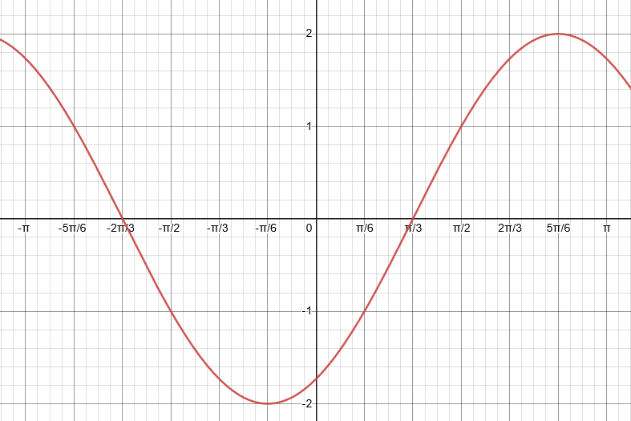

# Aufgabe 140
## Angabe

Man diskutiere die Funktion $f(x) = \sin{x} - \sqrt{3}\cdot \cos{x}$ im Intervall $I = [-\pi, \pi]$.

## Lösungsvorschlag

### Graph

### Nullstellen

$f(x)=0$\
$0=\sin{x} - \sqrt{3}\cdot \cos{x}$\
$\sqrt{3}\cdot \cos{x}=\sin{x}$\
$\sqrt{3}=\frac{\sin{x}}{\cos{x}}$ (nur legal weil $\cos{x}$ nicht $0$ ist wenn die obige Gleichung zutrifft)\ 
$\sqrt{3}=\tan{x}$\
$x=\arctan{\sqrt{3}}$

$x_1=\frac{\pi}{3}, \quad x_2=-\frac{2\pi}{3}$

Nullpunkte: $(\frac{\pi}{3}, 0), (-\frac{2\pi}{3}, 0)$

### Extremwerte

$f'(x)=0, f''(x)\neq0$

$f(x) = \sin{x} - \sqrt{3}\cdot \cos{x}$ \
$f'(x)=\cos{x}+\sqrt{3}\cdot \sin{x}$\
$f''(x)=-\sin{x}+\sqrt{3}\cdot \cos{x}$

$0=\cos{x}+\sqrt{3}\cdot \sin{x}$ \
$-\sqrt{3}\cdot \sin{x}=\cos{x}$ \
$-\sqrt{3}\cdot \frac{\sin{x}}{\cos{x}}$=1 \
$\tan{x}=-\frac{1}{\sqrt{3}}$\
$x=\arctan{\left(-\frac{1}{\sqrt{3}}\right)}$

$x_1=\frac{5\pi}{6}, \quad x_2=-\frac{\pi}{6}$

Sattelpunkte?

$f''(x_1)=-\sin{(\frac{5\pi}{6})}+\sqrt{3}\cdot \cos{(\frac{5\pi}{6})}$\
$f''(x_1)=-\frac{1}{2}+\sqrt{3}\cdot (-\frac{\sqrt{3}}{2})$ \
$f''(x_1)=-\frac{1}{2}-\frac{3}{2}$ \
$f''(x_1)=-2$

$-2\neq0 \implies$ An der Stelle $x_1$ ist kein Sattelpunkt 

$f''(x_2)=-\sin{(-\frac{\pi}{6})}+\sqrt{3}\cdot \cos{(-\frac{\pi}{6})}$ \
$f''(x_2)=\frac{1}{2}+\sqrt{3}\cdot \frac{\sqrt{3}}{2}$ \
$f''(x_2)=\frac{1}{2}+\frac{3}{2}$ \
$f''(x_2)=2$ 

$2 \neq 0 \implies$ An der Stelle $x_2$ ist kein Sattelpunkt

An den Stellen $x_1$ und $x_2$ befinden sich tatsächlich Extrempunkte und keine Sattelpunkte.

$f(x_1)=\sin{(\frac{5\pi}{6})}-\sqrt{3}\cdot \cos{(\frac{5\pi}{6})}$ \
$f(x_1)=\frac{1}{2}-\sqrt{3}\cdot (-\frac{\sqrt{3}}{2})$ \
$f(x_1)=\frac{1}{2}+\frac{3}{2}$ \
$f(x_1)=2$ 

$f(x_2)= \sin{(-\frac{\pi}{6})} - \sqrt{3}\cdot \cos{(-\frac{\pi}{6})}$\
$f(x_2)=-\frac{1}{2}-\sqrt{3}\cdot \frac{\sqrt{3}}{2}$ \
$f(x_2)=-\frac{1}{2}-\frac{3}{2}$ \
$f(x_2)=-2$

Extrempunkte: $(\frac{5\pi}{6}, 2), (-\frac{\pi}{6}, -2)$

### Wendestellen

$f''(x)=0, f'''(x)\neq0$

$f''(x)=-\sin{x}+\sqrt{3}\cdot \cos{x}$ \
$f'''(x)=-\cos{x}-\sqrt{3}\cdot \sin{x}$ 

$0=-\sin{x}+\sqrt{3}\cdot \cos{x}$ \
$\sin{x}=\sqrt{3}\cdot \cos{x}$ \
$\frac{\sin{x}}{\cos{x}}=\sqrt{3}$ \
$\tan{x}=\sqrt{3}$ \
$x=\arctan{\sqrt{3}}$

$x_1=\frac{\pi}{3}, \quad x_2=-\frac{2\pi}{3}$

Sind das wirklich Wendestellen?

$f'''(x_1)=-\cos{(\frac{\pi}{3})}-\sqrt{3}\cdot \sin{(\frac{\pi}{3})}$ \
$f'''(x_1)=-\frac{1}{2}-\frac{3}{2}$ \
$f'''(x_1)=-2$

$-2 \neq 0 \implies$ Die Stelle $x_1$ ist eine Wendestelle

$f'''(x_2)=-\cos{(-\frac{2\pi}{3}))}-\sqrt{3}\cdot \sin{(-\frac{2\pi}{3})}$\
$f'''(x_2)=\frac{1}{2}+\sqrt{3}\cdot \frac{\sqrt{3}}{2}$\
$f'''(x_2)=\frac{1}{2}+\frac{3}{2}$\
$f'''(x_2)=2$

$2 \neq 0 \implies$ Die Stelle $x_2$ ist eine Wendestelle

(Die Nullstellen sind auch Wendestellen)\
Wendepunkte: $(\frac{\pi}{3}, 0), (-\frac{2\pi}{3}, 0)$

### Konvexität

Krümmung an den Intervallgrenzen:

$f''(x)=-\sin{x}+\sqrt{3}\cdot \cos{x}$ 

$f''(-\pi)=-\sin{-\pi}+\sqrt{3}\cdot \cos{-\pi}=-\sqrt{3}$ \
$f''(\pi)=-\sin{\pi}+\sqrt{3}\cdot \cos{\pi}=-\sqrt{3}$

$$
f \text { im Intervall }   
\begin{cases}
[-\pi, -\frac{2\pi}{3} [ & \text{ rechts gekrümmt } \\
]-\frac{2\pi}{3}, \frac{\pi}{3} [ & \text{ links gekrümmt } \\
]\frac{\pi}{3}, \pi]  &\text { rechts gekrümmt }
\end{cases}
$$

