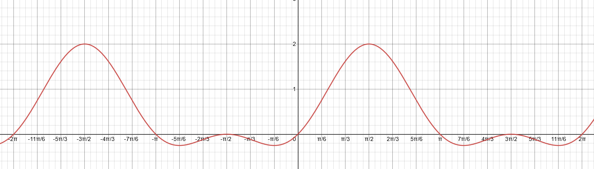

# Aufgabe 144
## Angabe

Man diskutiere die Funktion $f(x) = \sin{x} + (\sin{x})^2$ (d. h. man bestimme Nullstellen,
Extremwerte, Wendepunkte, Symmetrieeigenschaften, Periodizität, ...) und skizziere den
Funktionsgraphen.

## Lösungsvorschlag

### Graph

### Nullstellen

$f(x) = \sin{x} + (\sin{x})^2$\
$0=\sin{x} + (\sin{x})^2$\
$0= \sin{x}\cdot (1+\sin{x})$

$0=\sin{x}$\
$x=\arcsin{0}$

$x=k\cdot \pi, \quad k\in \Z$ 

$0=1+\sin{x}$\
$-1=\sin{x}$\
$x=\arcsin{(-1)}$

$x=-\frac{\pi}{2}+k \cdot 2\pi, \quad k \in \Z$

Nullpunkte: \
$\{(k \cdot 2\pi,0)|k \in \Z\}$\
$\{(-\frac{\pi}{2}+k \cdot 2\pi,0)|k \in \Z\}$

### Extremstellen

$f'(x)=0, f''(x)\neq0$

$f(x) = \sin{x} + (\sin{x})^2$

**Produktregel**:
$(f(x)g(x))'=f'(x)g(x)+f(x)g'(x)$

$f'(x)=\cos{x}+(\cos{x}\sin{x}+\sin{x}\cos{x})$\
$f'(x)=\cos{x}+2(\cos{x}\sin{x})$

$f''(x)=-\sin{x}+2(-\sin{x}\sin{x}+\cos{x}\cos{x})$\
$f''(x)=-\sin{x}-2(\sin^2{x}-\cos^2{x})$

$0=\cos{x}+2(\cos{x}\sin{x})$\
$0=\cos{x}\cdot (1+2\sin{x})$

$0=\cos{x}$\
$x=\arccos{0}$

$x_1=\frac{\pi}{2}+k \cdot 2\pi, \quad k \in \Z$ \
$x_2=-\frac{\pi}{2}+k \cdot 2\pi, \quad k \in \Z$

$0=1+2\sin{x}$\
$-1=2\sin{x}$\
$-\frac{1}{2}=\sin{x}$\
$x=\arcsin{(-\frac{1}{2})}$

$x_3=-\frac{\pi}{6}+k\cdot 2\pi, \quad k\in\Z$\
$x_4=\frac{7\pi}{6}+k\cdot 2\pi, \quad k\in\Z$

Sattelpunkte?

$f''(x)=-\sin{x}-2(\sin^2{x}-\cos^2{x})$

$f''(x_1)=-\sin{(\frac{\pi}{2})}-2(\sin^2{(\frac{\pi}{2})}-\cos^2{(\frac{\pi}{2})})$\
$f''(x_1)=-1+2(0-1)$\
$f''(x_1)= -3$

$-3 \neq 0 \implies$ An der Stelle $x_1$ ist kein Sattelpunkt 

$f''(x_2)=-\sin{(-\frac{\pi}{2})}-2(\sin^2{(-\frac{\pi}{2})}-\cos^2{(-\frac{\pi}{2})})$\
$f''(x_2)=1+2(0-1)$\
$f''(x_2)= -1$

$-1 \neq 0 \implies$ An der Stelle $x_2$ ist kein Sattelpunkt 

$f''(x_3)=-\sin{(-\frac{\pi}{6})}-2(\sin^2{(-\frac{\pi}{6})}-\cos^2{(-\frac{\pi}{6})})$\
$f''(x_3)=\frac{1}{2}+2(\frac{3}{4}-\frac{1}{4})$\
$f''(x_3)=\frac{3}{2}$

$\frac{3}{2} \neq 0 \implies$ An der Stelle $x_3$ ist kein Sattelpunkt 

$f''(x_4)=-\sin{(\frac{7\pi}{6})}-2(\sin^2{(\frac{7\pi}{6})}-\cos^2{(\frac{7\pi}{6})})$\
$f''(x_4)=\frac{1}{2}+2(\frac{3}{4}-\frac{1}{4})$\
$f''(x_4)=\frac{3}{2}$

$\frac{3}{2} \neq 0 \implies$ An der Stelle $x_4$ ist kein Sattelpunkt 

An den Stellen $x_1,x_2,x_3$ und $x_4$ befinden sich tatsächlich Extrempunkte und keine Sattelpunkte.

$f(x_1) = \sin{(\frac{\pi}{2})} + (\sin{(\frac{\pi}{2})})^2$ \
$f(x_1)=1+1$ \
$f(x_1)=2$ 

$f(x_2) = \sin{(-\frac{\pi}{2})} + (\sin{(-\frac{\pi}{2})})^2$ \
$f(x_2)=-1+1$ \
$f(x_2)=0$ 

$f(x_3) = \sin{(-\frac{\pi}{6})} + (\sin{(-\frac{\pi}{6})})^2$ \
$f(x_3)=-\frac{1}{2}+\frac{1}{4}$ \
$f(x_3)=-\frac{1}{4}$ 

$f(x_4) = \sin{(\frac{7\pi}{6})} + (\sin{(\frac{7\pi}{6})})^2$ \
$f(x_4)=-\frac{1}{2}+\frac{1}{4}$ \
$f(x_4)=-\frac{1}{4}$ 

Extrempunkte: \
$\{(\frac{\pi}{2}+k \cdot 2\pi,2)|k \in \Z\}$\
$\{(-\frac{\pi}{2}+k \cdot 2\pi,0)|k \in \Z\}$\
$\{(-\frac{\pi}{6}+k\cdot 2\pi,-\frac{1}{4})|k \in \Z\}$\
$\{(\frac{7\pi}{6}+k\cdot 2\pi)|k \in \Z\}$

### Wendestellen

$f''(x)=0, f'''(x)\neq0$

$f''(x)=-\sin{x}-2(\sin^2{x}-\cos^2{x})$\
$f''(x)=-\sin{x}-2\sin^2{x}+2\cos^2{x}$

**Produktregel**:
$(f(x)g(x))'=f'(x)g(x)+f(x)g'(x)$

$f'''(x)=-\cos{x}-2(\cos{x}\cdot \sin{x}+\sin{x}\cdot \cos{x})-2(-\sin{x}\cdot \cos{x}+\cos{x}\cdot (-\sin{x}))$ \
$f'''(x)=-\cos{x}-4(\cos{x}\cdot \sin{x})+2(-2(\sin{x}\cos{x}))$ \
$f'''(x)=-\cos{x}-4(\cos{x}\cdot \sin{x})-4(\sin{x}\cos{x})$ \
$f'''(x)=-\cos{x}-8(\cos{x}\cdot \sin{x})$ 

$0=-\sin{x}-2\sin^2{x}+2\cos^2{x}$ \
$0=-\sin{x}-2\sin^2{x}+2(1-\sin^2{x})$ \
$0=-\sin{x}-2\sin^2{x}+2-2\sin^2{x}$ \
$0=-\sin{x}-4\sin^2{x}+2$ \
$0=4\sin^2{x}+\sin{x}-2$

substituieren: $\sin{x}=u$

$0=4u^2+u-2$

$\displaystyle u_{1,2}=\frac{-1\pm\sqrt{1-4\cdot 4\cdot (-2)}}{8}$

$\displaystyle u_{1,2}=\frac{-1\pm\sqrt{33}}{8}$

$u_1=\frac{-1-\sqrt{33}}{8}, \quad u_2=\frac{-1-\sqrt{33}}{8}$

rücksubstituieren:

$\sin{\frac{-1+\sqrt{33}}{8}}$

$x_1=\arcsin{\left(\frac{-1+\sqrt{33}}{8}\right)}\approx0.6349+k\cdot 2\pi, \quad k\in\Z$\
$x_2=-\arcsin{\left(\frac{-1+\sqrt{33}}{8}\right)}\approx2.5067+k\cdot 2\pi, \quad k\in\Z$

$\sin{\frac{-1-\sqrt{33}}{8}}$

$x_3=\arcsin{\left(\frac{-1-\sqrt{33}}{8}\right)}\approx-1.0027+k\cdot 2\pi,\quad k \in \Z$\
$x_4=-\arcsin{\left(\frac{-1-\sqrt{33}}{8}\right)}\approx -2.1386+k\cdot 2\pi,\quad k \in \Z$

Sind das wirklich Wendestellen?

$f'''(x_1)=-\cos{x_1}-8(\cos{x_1}\cdot \sin{x_1}) \approx -4.6252$ \
$-4.6252 \neq 0 \implies$ Die Stelle $x_1$ ist eine Wendestelle

$f'''(x_1)=-\cos{x_2}-8(\cos{x_2}\cdot \sin{x_2}) \approx 4.6252$ \
$4.6252 \neq 0 \implies$ Die Stelle $x_2$ ist eine Wendestelle

$f'''(x_3)=-\cos{x_3}-8(\cos{x_3}\cdot \sin{x_3}) \approx 3.0894$ \
$3.0894 \neq 0 \implies$ Die Stelle $x_3$ ist eine Wendestelle

$f'''(x_4)=-\cos{x_4}-8(\cos{x_4}\cdot \sin{x_4}) \approx -3.0894$ \
$-3.0894 \neq 0 \implies$ Die Stelle $x_4$ ist eine Wendestelle

$f(x) = \sin{x} + (\sin{x})^2$

$f(x_1)\approx0.9448$ \
$f(x_2)\approx0.9448$

$f(x_3) \approx-0.1323$ \
$f(x_4) \approx-0.1323$

Wendepunkte:\
$\{(0.6349+k\cdot 2\pi,0.9448)|k \in \Z\}$\
$\{(2.5067+k\cdot 2\pi,0.9448)|k \in \Z\}$

$\{(-1.0027+k\cdot 2\pi,-0.1323)|k \in \Z\}$\
$\{(-2.1386+k\cdot 2\pi, -0.1323)|k \in \Z\}$

### Periodizität

Die Funktion ist periodisch und hat eine Periodendauer von $2\pi$.

### Symmetrie

**Achsensymmetrie**:\
$f(x)=f(-x)$

**Punktsymmetrie**:\
$f(x)=-f(-x)$

$f(\frac{\pi}{2})=2, f(-\frac{\pi}{2})=0 \implies$Funktion ist nicht achsensymmetrisch

$f(\frac{\pi}{2})=2, -f(-\frac{\pi}{2})=0 \implies$Funktion ist nicht punktsymmetrisch
