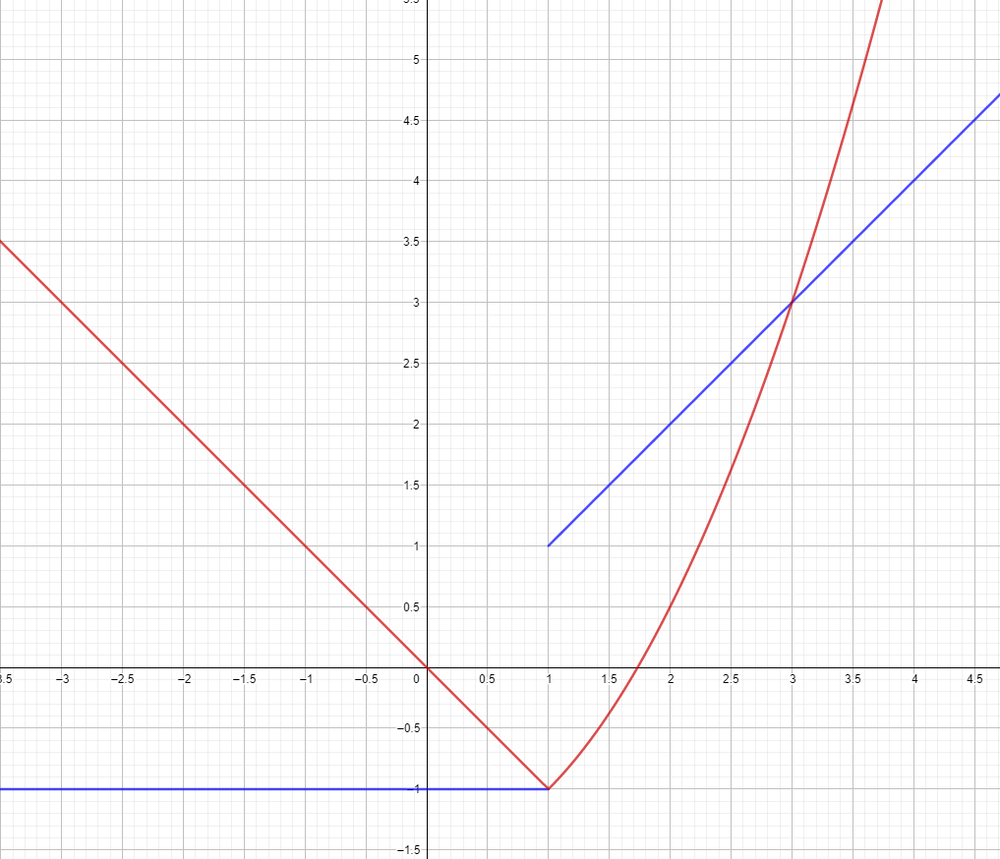

# Aufgabe 197
## Angabe

Für die Funktion $f(t)=\begin{cases}-1 & (t \le 1) \\ t & (t > 1) \end{cases}$ berechnen Sie $F(x)=\int_0^x f(t)\;dt$. Ist $F(x)$ stetig bzw. differenzierbar?

## Lösungsvorschlag

### Skizze

### Stetigkeit

$f(t)$ an der Stelle $t=1$ unstetig (siehe Skizze)

$F$ an der Stelle $x =-1$ auch unstetig?

Fallunterscheidung:

$x \le 1$: \
$\displaystyle F(x)=\int_0^x (-1) \;dt=(-t)\Big|_0^x=-x$

$x >  1$:\
$F(x)=\int_0^1 (-1) \;dt + \int_1^x (t) \;dt$

$\displaystyle  = (-t)\Big|_0^1+ \left(\frac{t^2}{2}\right)\Big|_1^x$

$\displaystyle =-1+\left(\frac{x^2}{2}-\frac{1}{2}\right)$

$\displaystyle =\frac{x^2}{2}-\frac{3}{2}$

**linksseitiger Grenzwert**:

Folge: $-\frac{1}{x}+1$

$\displaystyle \lim_{x \to 1-}F(1)=\lim_{x \to \infin}F\left(-\frac{1}{x}+1\right)=\lim_{x \to \infin} -\left(-\frac{1}{x}+1\right)$

$= -1$

**rechtsseitiger Grenzwert**:

Folge: $\frac{1}{x}+1$

$\displaystyle \lim_{x \to 1+}F(1)=\lim_{x \to \infin}F\left(\frac{1}{x}+1\right)=\lim_{x \to \infin} \frac{(\frac{1}{x}+1)^2}{2}-\frac{3}{2}$

$\displaystyle =\frac{1}{2}-\frac{3}{2}=-1$

linkseitiger und rechtsseitiger Grenzwert gleich$\implies$ stetig $\checkmark$

### Differenzierbarkeit

Folge: $-\frac{1}{x}+1$

**links**:

$\displaystyle \lim_{x \to 1-} \frac{F(x)-F(1)}{x-1}=\lim_{x \to \infin} \frac{\left(-\left(-\frac{1}{x}+1\right)\right)-\left(-1{}\right)}{-\frac{1}{x}+1-1}$

$\displaystyle =\lim_{x \to \infin} \frac{\frac{1}{x}-1+1}{-\frac{1}{x}+1-1}= \lim_{x \to \infin} \frac{\frac{1}{x}}{-\frac{1}{x}}=\lim_{x \to \infin}-\frac{x}{x}$

de l'Hospital

$\displaystyle =\lim_{x \to \infin}-\frac{1}{1}=-1$

**rechts**

Folge: $\frac{1}{x}+1$

$\displaystyle \lim_{x \to 1+} \frac{F(x)-F(1)}{x-1}=\lim_{x \to \infin}\frac{(\frac{(\frac{1}{x}+1)^2}{2}-\frac{3}{2})-(\frac{1^2}{2}-\frac{3}{2})}{(\frac{(\frac{1}{x}+1)^2}{2}-\frac{3}{2})-1}$

$\displaystyle =\lim_{x \to \infin}\frac{(\frac{(\frac{1}{x}+1)^2}{2}-\frac{3}{2})+1}{(\frac{(\frac{1}{x}+1)^2}{2}-\frac{3}{2})-1}$

$\displaystyle =\lim_{x \to \infin}\frac{\frac{(\frac{1}{x}+1)^2}{2}-\frac{1}{2}}{\frac{(\frac{1}{x}+1)^2}{2}-\frac{5}{2}}$

$\displaystyle =\lim_{x \to \infin}\frac{\frac{(\frac{1}{x}+1)^2-1}{2}}{\frac{(\frac{1}{x}+1)^2-5}{2}}$

$\displaystyle =\lim_{x \to \infin} \frac{\cancel{2}\cdot ((\frac{1}{x}+1)^2-1)}{\cancel{2} \cdot ((\frac{1}{x}+1)^2-5)}$

$\displaystyle =\lim_{x \to \infin} \frac{((\frac{1}{x}+1)^2-1)}{((\frac{1}{x}+1)^2-5)}$

$\displaystyle =\frac{\lim_{x \to \infin} ((\frac{1}{x}+1)^2-1)}{\lim_{x \to \infin} ((\frac{1}{x}+1)^2-5)}$

$\displaystyle =\frac{((0+1)^2-1)}{((0+1)^2-5)}$

$\displaystyle =\frac{0}{-4}=0$

**Conclusio**

$0 \neq -1 \implies F$ ist an der Stelle $x=1$ nicht differenzierbar.  