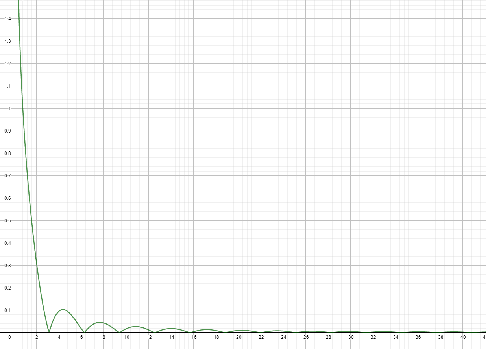

# Aufgabe 252
## Angabe

Untersuchen Sie die folgenden uneigentlichen Integrale auf Konvergenz.

$\displaystyle \int_0^\infin \frac{|\sin{x}|}{x^{\frac{3}{2}}} \;dx$

## Hilfreiches

**Definition 5.58**

Sei $f$ auf $[a,b)$ definiert und auf jedem Teilintervall $[a,c] \subset [a, b)$ integrierbar. Weiters sei $\lim_{x \to b-} f(x)=\infin$ (bzw. $-\infin$). Dann nennt man das Integral 

$\displaystyle \quad \int_a^b f(x) \; dx = \lim_{c\to b-}\int_a^c f(x) \;dx$

uneigentliches Integral erster Art. Man spricht von Konvergenz bzw. Divergenz des Integrals je nachdem, ob dieser Grenzwert im eigentlich Sinn existiert oder nicht. Eine analoge Definition gilt für Intervalle $(a,b]$ mit $\lim_{x \to b+} f(x)=\pm \infin$. 

Sei $a \in \R$ fest. Für eine auf jedem Intervall $[a,b]\subset [a, \infin)$ integrierbare Funktion $f$ nennt man das Integral 

$\displaystyle \quad \int_a^\infin f(x) \; dx = \lim_{b \to \infin}\int_a^b f(x) \;dx$

uneigentliches Integral zweiter Art. Auch dieses Integral kann entweder konvergent oder divergent sein, wobei - ebenso wie zuvor - im Fall der Konvergenz der Grenzwert nicht uneigentlich sein darf. Eine analoge Definition gilt für Intervalle $(-\infin, b]$.

**Satz 5.61**
Seien $f$ und $g$ stückweise stetige Funktionen auf $[0, \infin)$ und gelte $|f(x)| \le g(x)$ für alle $x \ge 0$. Ist $\int_0^\infin g(x) \;dx$ konvergent, so ist $\int_0^\infin f(x) \;dx$ ebenfalls konvergent. 

## Lösungsvorschlag

### Skizze

### erster Versuch

$|\sin{x}|\le 1$

$\displaystyle \int_0^\infin \frac{|\sin{x}|}{x^{\frac{3}{2}}} \; dx \le \int_0^\infin \frac{1}{x^{\frac{3}{2}}} \; dx$

$\displaystyle \int_0^\infin \frac{1}{x^{\frac{3}{2}}} \; dx$

$\displaystyle \lim_{b \to \infin} \int_0^b x^{-\frac{3}{2}} \; dx$

$\displaystyle \lim_{b \to \infin} \frac{x^{-\frac{3}{2}+1}}{-\frac{3}{2}+1}\Big|_0^b$

$\displaystyle \lim_{b \to \infin} \frac{x^{-\frac{1}{2}}}{-\frac{1}{2}}\Big|_0^b$

$\displaystyle \lim_{b \to \infin} -\frac{2}{\sqrt{x}}\Big|_0^b$

$\displaystyle -2 \cdot \lim_{b \to \infin} \frac{1}{\sqrt{x}}\Big|_0^b$

$\displaystyle -2 \cdot \lim_{b \to \infin} \left(\frac{1}{\sqrt{b}}-\frac{1}{\sqrt{0}}\right)$

$\displaystyle -2 \cdot \left(0-\color{red}\frac{1}{0}\color{reset}\right)$

$\displaystyle \frac{1}{0}$ ist nicht definiert

### zweiter Versuch

$|\sin{x}|\le x$

$\displaystyle \int_0^\infin \frac{|\sin{x}|}{x^{\frac{3}{2}}} \; dx \le \int_0^\infin \frac{x}{x^{\frac{3}{2}}} \; dx$

$\displaystyle \int_0^\infin \frac{1}{x^{\frac{1}{2}}} \; dx$

$\displaystyle \lim_{b \to \infin} \int_0^b x^{-\frac{1}{2}} \; dx$

$\displaystyle \lim_{b \to \infin} \frac{x^{-\frac{1}{2}+1}}{-\frac{1}{2}+1} \Big|_0^b$

$\displaystyle \lim_{b \to \infin} \frac{x^{\frac{1}{2}}}{\frac{1}{2}} \Big|_0^b$

$\displaystyle \lim_{b \to \infin} 2 \cdot \sqrt{x} \Big|_0^b$

$\displaystyle 2 \cdot \lim_{b \to \infin}  (\sqrt{b}-\sqrt{0})$

$\displaystyle 2 \cdot \color{red}\lim_{b \to \infin}  (\sqrt{b}\color{reset}-0)$

Das Integral $\displaystyle  \int_0^\infin \frac{x}{x^{\frac{3}{2}}} \; dx$ konvergiert nicht, also können wir damit nichts über das ursprüngliche Integral sagen.

### Aufspalten

$\displaystyle \int_0^\infin \frac{|\sin{x}|}{x^{\frac{3}{2}}} \;dx=\int_0^a \frac{|\sin{x}|}{x^{\frac{3}{2}}} \; dx+\int_a^\infin \frac{|\sin{x}|}{x^{\frac{3}{2}}} \;dx$

wobei: $a \in (0,\infin)$

$\color{magenta}|\sin{x}|\le x$ \
$\color{orange}|\sin{x}|\le 1$

$\displaystyle \color{magenta}\int_0^a \frac{|\sin{x}|}{x^{\frac{3}{2}}}\;dx\color{reset}+\color{orange}\int_a^\infin \frac{|\sin{x}|}{x^{\frac{3}{2}}} \;dx \color{reset}\le \color{magenta} \int_0^a \frac{1}{\sqrt{x}} \; dx \color{reset} + \color{orange}\int_a^\infin \frac{1}{x\cdot \sqrt{x}}\;dx$

**erstes Integral**

$\displaystyle \color{magenta} \int_0^a \frac{1}{\sqrt{x}} \; dx \color{reset}$

$=2\cdot (\sqrt{x})\Big|_0^a$

$=2\cdot (\sqrt{a}-\sqrt{0})$

$=\color{magenta}2\sqrt{a}$

**zweites Integral**

$\displaystyle \color{orange}\int_a^\infin \frac{1}{x\cdot \sqrt{x}}\;dx \color{reset}$

$\displaystyle = \lim_{b \to \infin}-2 \cdot \left(\frac{1}{\sqrt{x}}\right)\Big|_a^b$

$\displaystyle =-2\cdot \lim_{b \to \infin}\left(\frac{1}{\sqrt{b}}- \frac{1}{\sqrt{a}}\right)$

$\displaystyle =-2\cdot \left(0- \frac{1}{\sqrt{a}}\right)$

$\displaystyle =\color{orange}\frac{2}{\sqrt{a}}$

**Integrale zusammenfügen**

$\displaystyle \color{magenta}\int_0^a \frac{|\sin{x}|}{x^{\frac{3}{2}}}\;dx\color{reset}+\color{orange}\int_a^\infin \frac{|\sin{x}|}{x^{\frac{3}{2}}} \;dx \color{reset}\le \color{magenta}2\sqrt{a} \color{reset} + \color{orange}\frac{2}{\sqrt{a}}$

wann ist der Term $\displaystyle \left(\color{magenta}2\sqrt{a} \color{reset} + \color{orange}\frac{2}{\sqrt{a}}\color{reset}\right)$ maximal? $\implies a=1$

$\displaystyle \color{magenta}\int_0^a \frac{|\sin{x}|}{x^{\frac{3}{2}}}\;dx\color{reset}+\color{orange}\int_a^\infin \frac{|\sin{x}|}{x^{\frac{3}{2}}} \;dx \color{reset}\le 4$

$\displaystyle \int_0^\infin \frac{|\sin{x}|}{x^{\frac{3}{2}}} \;dx \le 4$

Aus dem Satz 5.61 folgt, dass das Integral konvergiert.