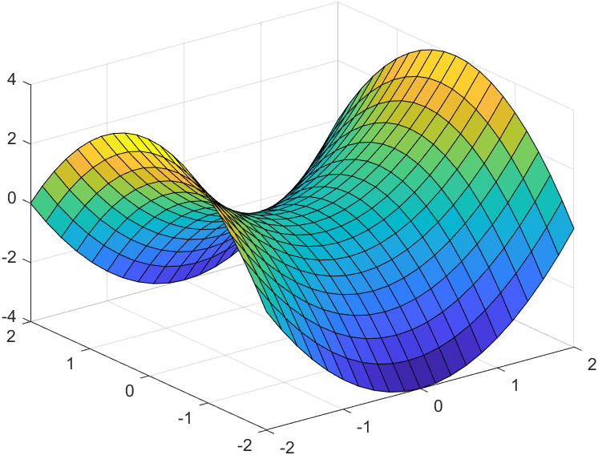
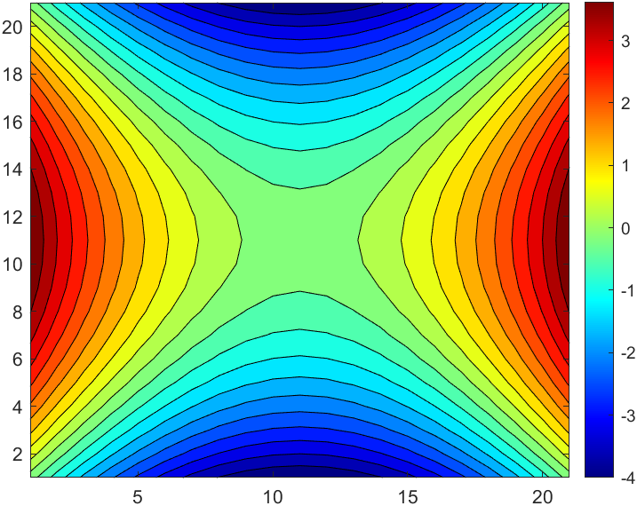
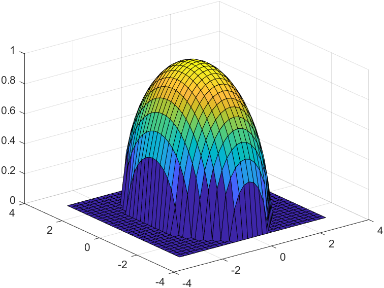
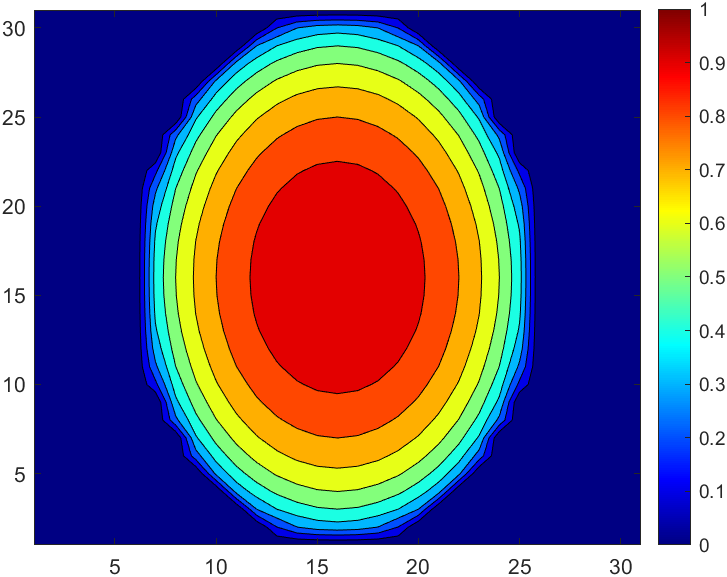

# Aufgabe 291
## Angabe

Man stelle den Definitionsbereich und den Wertebereich folgender Funktionen fest 
und beschreibe die Höhenlinien:

$\displaystyle (a)\quad z=x^2-y^2$

$\displaystyle(b) \quad z=\sqrt{1-\frac{x^2}{4}-\frac{y^2}{9}}$

## Hilfreiches

Eine andere Möglichkeit der Darstellung von Funktionen in zwei Variablen sind Nievaulinien (Isohypsen). Wie die Höhenschichtlinien in Landkarten beschreiben sie jeweils eine Punktmenge, auf der die Funktionen einen vorgegebenn konstanten Wert hat. ie Niveaulinie zum Niveau $c$ der Funktion $f(x,y)$ ist die Menge $\{(x,y)\in D | f(x,y)=c\}$

## Lösungsansatz

**erste Funktion**

$\displaystyle (a)\quad z=x^2-y^2$

$D=\R^2, \quad W=\R$

Höhenlinien:

$z_0=x^2-y^2$

$\displaystyle \frac{x^2}{z_0}-\frac{y^2}{z_0}=1$

$\implies$ Hyperbelgleichung 

**zweite Funktion**

$\displaystyle(b) \quad z=\sqrt{1-\frac{x^2}{4}-\frac{y^2}{9}}$

$\displaystyle 1-\frac{x^2}{4}-\frac{y^2}{9} \ge 0 \iff \frac{x^2}{4}+\frac{y^2}{9}\le1$

$\displaystyle D=\{x,y \in \R\;\Big|\;\frac{x^2}{4}+\frac{y^2}{9}\le1\}$

$W=[0,1]$

Höhenlinien:

$\displaystyle z_0=\sqrt{1-\frac{x^2}{4}-\frac{y^2}{9}}$

$\displaystyle (z_0)^2=1-\frac{x^2}{4}-\frac{y^2}{9}$

$\displaystyle 1=\frac{1}{1(z_0)^2}-\frac{x^2}{4 (z_0)^2}-\frac{y^2}{9 (z_0)^2}$

$\displaystyle 1=\frac{9}{9(z_0)^2}-\frac{x^2}{4 (z_0)^2}-\frac{y^2}{9 (z_0)^2}$

$\displaystyle 1=-\frac{x^2}{4 (z_0)^2}+\frac{9-y^2}{9 (z_0)^2}$

$\implies$ Ellipsengleichung

