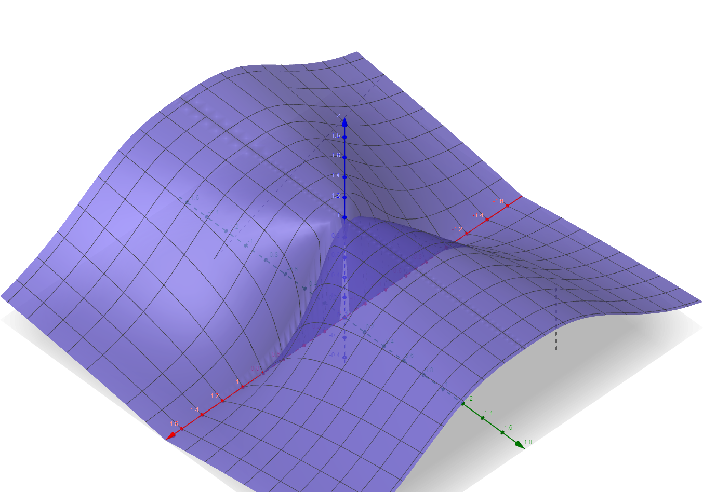

# Aufgabe 298
## Angabe

Man untersuche für beliebige $\alpha, \beta \in \R$ den Grenzwert $\displaystyle \lim_{t\to0}f(\alpha t, \beta t)$. Ist die Funktion $f(x,y)$ an $(0,0)$ stetig?

$\displaystyle f(x,y)=\frac{|y|}{|x|^3+|y|}\quad$für $(x,y)\neq (0,0)$ und $f(0,0)=1$

## Hilfreiches

**Definition 6.3**
Sei $D \in \R^n$ und $f: D \to \R$. Unter dem Grenzwert $\lim_{x \to x_0} f(x)$ versteht man jene Zahl $c$, die folgende Eigenschaft besitzt: Für alle $\varepsilon > 0$ existiert ein $\delta > 0$, so dass für alle $x \in D$ mit $0 < \|x-x_0\| < \delta$ die Ungleichung $|f(x)-c|<\varepsilon$ gilt.

Die Funktion $f$ heißt stetig an der Stelle $x_0 \in D$, falls $\lim_{x \to x_0} f(x) = f(x_0)$, und stetig auf $D$, wenn $f$ an jeder Stelle $x_0 \in D$ stetig ist. 

## Lösungsvorschlag

### Skizze

Geogebra:
`f(x,y)=Wenn(x≟0 ∧ y≟0, 1, (abs(y))/((abs(x))^(3)+abs(y)))`

### Grenzwert

$\displaystyle \lim_{t\to0}f(\alpha t, \beta t)=\lim_{t\to0}\frac{|\beta t|}{|\alpha t|^3 + |\beta t|}$

$\displaystyle \alpha \neq 0, \beta =0: \lim_{t \to 0}f(\alpha t, 0)=\lim_{t\to0}\frac{0}{|\alpha t|^3 + 0}=\color{red}0$

$\displaystyle a \in \R, \beta \neq 0: \lim_{t\to0}f(\alpha t, \beta t)=\lim_{t\to0}\frac{|\beta t|}{|\alpha t|^3 + |\beta t|}$

$\displaystyle =\lim_{t\to0} \frac{|\beta| \cdot \cancel{|t|}}{|\alpha|^3 \cdot |t|^{\cancel{3}} + |\beta| \cdot \cancel{|t|}}$

$\displaystyle =\frac{|\beta|}{|\alpha|^3 \cdot 0 + |\beta|}$

$\displaystyle =\frac{|\beta|}{|\beta|} = \color{red}1$

Der Grenzwert existiert nicht, also ist die Funktion an der Stelle $(0,0)$ unstetig.