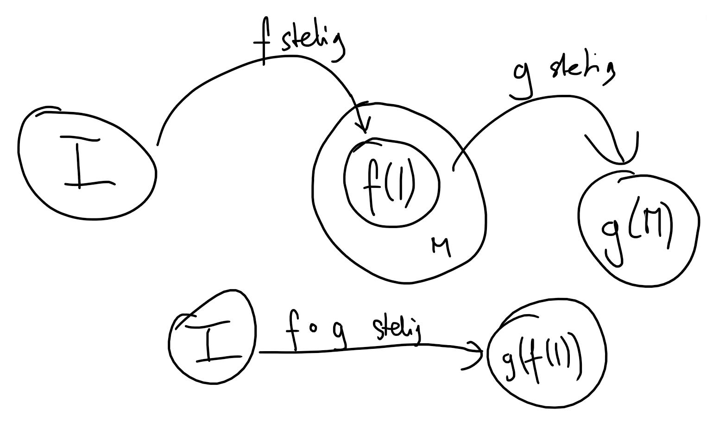

# Aufgabe 307
## Angabe

Zeigen Sie: Die Komposition stetiger Funktionen $f: I \subseteq \R \to \R^n,g:M\subseteq \R^n \to \R^m$ mit $f(I) \subseteq M$ ist wiederum stetig.

## Hilfreiches

**Definition 6.3** \
Sei $D \in \R^n$ und $f: D \to \R$. Unter dem Grenzwert $\lim_{x \to x_0} f(x)$ versteht man jene Zahl $c$, die folgende Eigenschaft besitzt: Für alle $\varepsilon > 0$ existiert ein $\delta > 0$, so dass für alle $x \in D$ mit $0 < \|x-x_0\| < \delta$ die Ungleichung $|f(x)-c|<\varepsilon$ gilt.

Die Funktion $f$ heißt stetig an der Stelle $x_0 \in D$, falls $\lim_{x \to x_0} f(x) = f(x_0)$, und stetig auf $D$, wenn $f$ an jeder Stelle $x_0 \in D$ stetig ist. 

## Lösungsvorschlag

### Definitionen aus der Angabe

$\displaystyle \forall x_0 \in I: \lim_{x \to x_0} f(x)=x_0$

$\displaystyle \forall x_0 \in M: \lim_{x \to x_0} g(x)=x_0$

### Zusätzliche Bedingung

$\displaystyle \forall x_0 \in f(I):\lim_{x \to x_0}g(x)=g(x_0)$

### Folgerung

$\displaystyle \forall x_0 \in I: \lim_{x \to x_0}g(f(x))=g(f(x_0))$

$\implies g \circ f$ ist auch stetig

